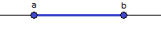

[](https://www.nuget.org/packages/Interval/)

# Interval

Generic library of types to describe interval of any points that can be compared to eachother. The library is as small as possible to be useful. I've created it to use in my own implimentation of [Iterval Centered Tree](https://github.com/RetailRocket/CenteredIntervalTree). To do it I was need a couple of additional operation which I've implemented in external library of [Interval Operations](https://github.com/RetailRocket/Interval.Operations) on purpose to keep this library clear.

Each boundary contains method ```CompareToPoint``` it allows to get position of point compare to boundary. For example point 0 with comparison to open lower bound of 0 will be less but for closed lower bound it will be equal. Infinity lower bound will be always less than any point but Infinity upper bound will be greater than any point.

## Usage ###

### Interval 

Interval type is generic type and can have boundaries point of any type, but for comparison operation you will need to have comparer class for point type

```csharp
var closedInterval = new Interval<int>(
    lowerBound: ...,
    upperBound: ...
);
```

### Interval Boundaries

Interval type have two boundaries, each of them have three possible types. It enable to have up to nine different intervals.

#### Closed Interval

Both boundaries points are inculded to theinterval



[a, b] = {x | a <= x <= b}

```csharp
var closedInterval = new Interval<int>(
    lowerBound: new ClosedLowerBound<int>(0),
    upperBound: new ClosedUpperBound<int>(10));
```
#### Open Interval

Both boundaries points are not inculded to the interval


(a, b) = {x | a < x < b}

```csharp
var closedInterval = new Interval.Interval<int>(
    lowerBound: new OpenLowerBound<int>(0),
    upperBound: new OpenUpperBound<int>(10));
```

#### Infinity Interval
This interval include any point


(∞, ∞) = {x | ∞ < x < ∞}

```csharp
var closedInterval = new Interval<int>(
    lowerBound: new InfinityLowerBound<int>(),
    upperBound: new InfinityUpperBound<int>());
```

And you can combine bounds

#### Open Closed Interval
Lower boundary point is not included to the interval, upper bound is included to the interval


(a, b] = {x | a < x <= b}

```csharp
var openClosedInterval = new Interval<int>(
    lowerBound: new OpenLowerBound<int>(0),
    upperBound: new ClosedUpperBound<int>(10));
```

#### Closed Open Interval
Lower boundary point is included to the interval, upper bound is not


[a, b) = {x | a <= x < b}

```csharp
var openClosedInterval = new Interval<int>(
    lowerBound: new ClosedLowerBound<int>(0),
    upperBound: new OpenUpperBound<int>(10));
```

### Infinity Open Interval
Lower boundary is infinity and any point of the interval is more than it boundary, upper boundary point is not included to the interval


(∞, a) = {x | ∞ < x < b}

```csharp
var openClosedInterval = new Interval<int>(
    lowerBound: new InfinityLowerBound<int>(0),
    upperBound: new OpenUpperBound<int>(10));
```


### Infinity Closed Interval
Lower boundary is infinity and any point of the interval is more than it boundary, upper boundary point is included to the interval


(∞, a) = {x | ∞ < x <= b}

```csharp
var openClosedInterval = new Interval<int>(
    lowerBound: new InfinityLowerBound<int>(0),
    upperBound: new ClosedUpperBound<int>(10));
```

### Open Infinity Interval
Lower boundary point is not included to the interval, upper bound is infinity and any point of interval is less that it boundary


(a, ∞) = {x | a < x < ∞}

```csharp
var openClosedInterval = new Interval<int>(
    lowerBound: new OpenUpperBound<int>(0),
    upperBound: new InfinityUpperBound<int>(10));
```

### Closed Infinity Interval
Lower boundary point is included to the interval, upper bound is infinity and any point of interval is less that it boundary


[a, ∞) = {x | a <= x < ∞}

```csharp
var openClosedInterval = new Interval<int>(
    lowerBound: new ClosedUpperBound<int>(0),
    upperBound: new InfinityUpperBound<int>(10));
```

### Boundary Operation

Every boundary can be compared to point by ```CompareToPoint``` method. Methor returns -1 boundary at the left, 1 if the boundary at the right and 0 if point on the boundary.

```csharp
  new ClosedLowerBound<int>(10)
    .CompareToPoint(
        point: 10,
        comparer: Comparer<int>.Default); // > 0 - point is on the boundary
```

### Additional Operation

Additional operation you can find in library [Interval Operations](https://github.com/RetailRocket/Interval.Operations)
