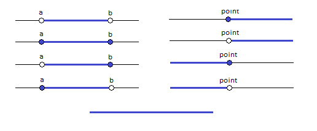

[](https://www.nuget.org/packages/Interval/)

# Interval

Generic library of types to describe interval of any points that can be compared to eachother. The library is as small as possible to be useful. I've created it to use in my own implimentation of [Iterval Centered Tree](https://github.com/RetailRocket/CenteredIntervalTree). To do it I was need a couple of additional operation which I've implemented in external library of [Interval Operations](https://github.com/RetailRocket/Interval.Operations) on purpose to keep this library clear.

## Description ###

Interval<TPoint> with lower and upper bounds. Each of bound can be of three types: Open, Close and Infinity. It alows to create combinations of intervals:



* closed [a, b]
* open (a, b)
* openClosed (a, b]
* closedOpen [a, b)
* infinityOpen [∞, a)
* infinityClosed [∞, a]
* openInfinity (a, ∞]
* closedInfinity [a, ∞)

Each boundary contains method ```CompareToPoint``` is allows to get position of point compare to boundary. For example point 0 with comparison to open lower bound of 0 will be less but for closed lower bound it will be equal. Infinity lower bound will be always less than any point but Infinity upper bound will be greater than any point.

## Usage ###

### Interval Boundaries

Every interval have two boundaries, each have three possible types. It enable to have up to nine different intervals.

#### Closed Interval
```csharp
var closedInterval = new Interval.Interval<int>(
    lowerBound: new ClosedLowerBound<int>(0),
    upperBound: new ClosedUpperBound<int>(10));
```
#### Open Interval
```csharp
var closedInterval = new Interval.Interval<int>(
    lowerBound: new OpenLowerBound<int>(0),
    upperBound: new OpenUpperBound<int>(10));
```

#### Infinity Interval
```csharp
var closedInterval = new Interval.Interval<int>(
    lowerBound: new InfinityLowerBound<int>(),
    upperBound: new InfinityUpperBound<int>());
```

And you can combine bounds, for example

#### Open Closed Interval

```csharp
var openClosedInterval = new Interval.Interval<int>(
    lowerBound: new OpenLowerBound<int>(0),
    upperBound: new ClosedUpperBound<int>(10));
```

etc.


### Boundary Operation

Every boundary can be compared to point by ```CompareToPoint``` method. Methor returns -1 boundary at the left, 1 if the boundary at the right and 0 if point on the boundary.

```csharp
  new ClosedLowerBound<int>(10)
    .CompareToPoint(
        point: 10,
        comparer: Comparer<int>.Default); // > 0 - point is on the boundary
```

### Additional Operation

Additional operation you can find in library [Interval Operations](https://github.com/RetailRocket/Interval.Operations)
